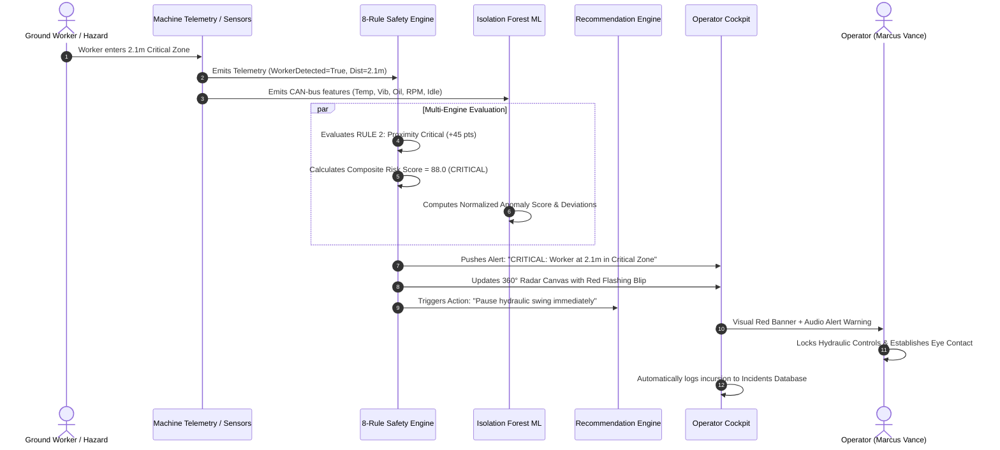

# CAT OperatorIQ System Architecture

## 1. High-Level Architecture Overview

CAT OperatorIQ is structured as an industrial-grade cyber-physical assistant connecting real-time machine sensor feeds with multi-rule deterministic safety engines, explainable machine learning models, and human-in-the-loop interfaces.

```mermaid
graph TD
    subgraph Machine & Edge Telemetry
        Sensors[CAN-Bus Sensors / GPS / LiDAR] --> StreamGen[Real-Time Telemetry Stream]
        SimPanel[Judge Hazard Injection Panel] --> StreamGen
    end

    subgraph Backend Pipeline [FastAPI Core Services]
        StreamGen --> WS[WebSocket /ws/telemetry & REST]
        WS --> SafetyEng[Rule-Based Safety Engine (0-100 Score)]
        WS --> AnomEng[ML Anomaly Detection (Isolation Forest)]
        SafetyEng --> RecEng[Contextual Recommendation Engine]
        AnomEng --> RecEng
        
        TaskData[Tasks & Work Orders] --> MLReg[Task Completion Predictor (Gradient Boosting)]
        MLReg --> TaskETA[Explainable Duration & ETA]
        
        KB[(Markdown Knowledge Base)] --> RAG[RAG Retrieval Engine]
        RAG --> Assistant[Deterministic Intent AI Assistant]
    end

    subgraph Data Layer [Dual Engine Persistence]
        DB[(PostgreSQL / SQLite Database)]
        Models[(Serialized ML Joblib Artifacts)]
    end

    SafetyEng -.-> DB
    AnomEng -.-> DB
    TaskData -.-> DB
    Assistant -.-> DB
    MLReg -.-> Models
    AnomEng -.-> Models

    subgraph Frontend Industrial Cockpit [React + Vite + Tailwind]
        WS --> LiveRadar[360° Proximity Radar]
        WS --> Gauges[Sensor Telemetry Gauges]
        SafetyEng --> AlertBanner[Safety Status & Advisory Banners]
        TaskETA --> TaskBoard[Task Schedule & Duration Details]
        RecEng --> TrainingHub[Training & Competency Hub]
        DB --> Incidents[Incident Management & Resolutions]
        Assistant --> ChatUI[Conversational Assistant Console]
    end
```

---

## 2. Telemetry Processing & Hazard Detection Data Flow



---

## 3. Machine Learning Architecture

### A. Task Duration Regression (`ml/task_time_model.py`)
- **Objective**: Accurately predict actual task duration in minutes.
- **Model Comparison**: `RandomForestRegressor` vs `GradientBoostingRegressor`.
- **Selected Model**: `GradientBoostingRegressor` (MAE = 4.13 min, RMSE = 5.91 min, $R^2 = 0.964$).
- **Features**: Task type, weather conditions, operator skill, machine age, load cycles, haul distance, operator historical baseline, machine utilization.
- **Explainability**: Additive factor contribution breakdown ($+7.5$ min due to Rainy ground, $-6.5$ min due to Expert operator skill).

### B. Unsupervised Telemetry Anomaly Detection (`ml/anomaly_detection.py`)
- **Objective**: Detect mechanical and behavioral anomalies without requiring labeled failure datasets.
- **Algorithm**: `IsolationForest` (contamination rate = 5.0%, 100 estimators).
- **Features**: `engine_temperature`, `oil_pressure`, `hydraulic_pressure`, `engine_rpm`, `vibration`, `idling_time_min`.
- **Explainability Engine**: Computes $Z$-score and percentage deviation from empirical machine baselines, translating raw isolation paths into actionable engineering statements.

---

## 4. Safety Advisory Principle Implementation

The system strictly adheres to the non-negotiable safety principle:
1. **Advisory Role**: AI recommendations and hazard alerts never take control of machine steering, braking, swing, or implements.
2. **Mandatory Advisory Notice**: Every advisory interface, report, and conversational AI response displays:
   > *"AI-generated recommendations are advisory and must not replace official operating procedures, safety procedures, operator training, or professional judgment."*
